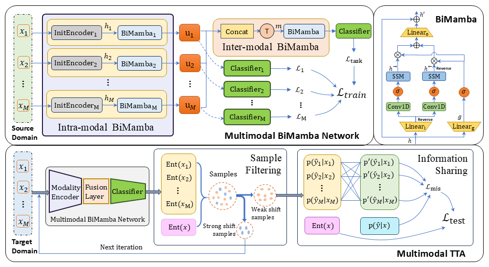

# BiM-TTA

This repository contains the official PyTorch implementation for the paper  
**"[A Multimodal BiMamba Network with Test-Time Adaptation for Emotion Recognition Based on Physiological Signals]"**, published at *NeurIPS 2025*.

Our proposed **BiM-TTA** framework performs **multimodal emotion recognition** using physiological signals (e.g., EEG, EOG, EMG), and incorporates **Test-Time Adaptation (TTA)** to enhance robustness under distribution shifts and incomplete modalities.

## Model Overview



The repository includes the core network implementations:

```

code/
├── Multi_Modal_BiMamba_Network.py      # Main multimodal BiMamba network definition
├── Multi_Modal_TTA.py                  # Test-Time Adaptation (TTA) implementation
└── mamba/                              # Core Mamba state-space modeling components
    ├── **init**.py
    ├── bimamba.py                      # BiMamba/SSM backbone implementation
    └── selective_scan_interface.py     # Selective scan mechanism implementation

````

**Note:**  
This version of the repository provides the core architecture only.  
Dataset preprocessing, training, and evaluation scripts (e.g., `main.py`, `prepare_data.py`) will be released later.


## Environment Setup

We recommend using the following environment configuration:

```bash
conda create --name BiM-TTA python=3.8
conda activate BiM-TTA
pip install -r requirements.txt
````

Recommended versions (adjust based on your CUDA setup):

* Python 3.8
* CUDA 11.8
* PyTorch 2.3.1+cu118
* scipy 1.14.0
* scikit-learn 1.5.1
* mne 1.8.0
* causal-conv1d 1.4.0
* mamba_ssm 2.2.2

If there is a configuration problem with **mamba**, please check the [official repository](https://github.com/state-spaces/mamba) for detailed installation guidance.

## Citation

If you find this work useful, please cite our paper:

```bibtex
@inproceedings{
jia2025a,
title={A Multimodal BiMamba Network with Test-Time Adaptation for Emotion Recognition Based on Physiological Signals},
author={Ziyu Jia and Tingyu Du and Zhengyu Tian and Hongkai Li and Yong Zhang and Chenyu Liu},
booktitle={The Thirty-ninth Annual Conference on Neural Information Processing Systems},
year={2025},
url={https://openreview.net/forum?id=3vLp3J7540}
}
```
